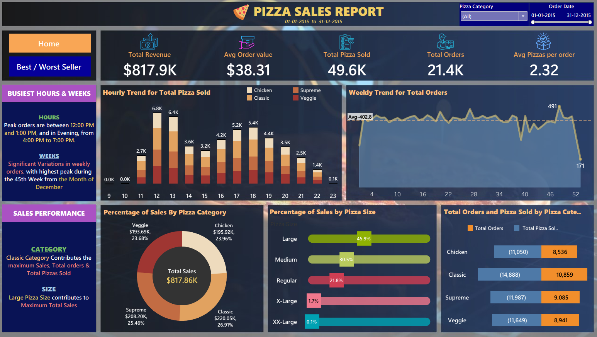
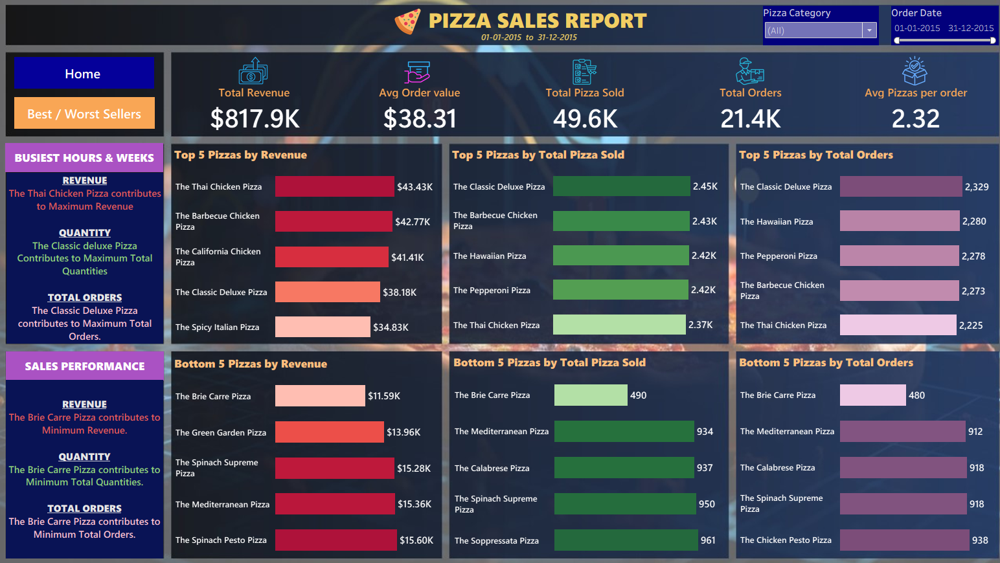

# Pizza Sales Analysis (SQL & Tableau)

## 📌 Business Problem & Objectives
An active, high-volume pizza franchise needs to optimize its hourly staff allocation, product pricing tiers, and ingredient inventory pipelines. This project analyzes a comprehensive dataset covering **49,574 individual pizza sales** across **21,350 distinct orders** to isolate high-yield menu items, define peak ordering schedules, and identify underperforming assets for strategic elimination or marketing updates.

## 📊 Core Operational Metrics (1-Year Aggregate)
* **Total Gross Revenue:** $817,860.05
* **Total Volume Sold:** 49,574 units
* **Total Orders Processed:** 21,350
* **Average Ticket Value (AOV):** $38.31
* **Average Items Per Order:** 2.32 pizzas

## 🛠️ Data Infrastructure & Methodology
* **Relational Database Design (SQL):** Conducted performance aggregations, structural group-bys, and granular time parsing (`HOUR()`, `WEEK()`) to compile operational performance data. Check out the script workspace in [pizza_sales_queries.sql](./pizza_sales_queries.sql).
* **Business Intelligence (Tableau):** Crafted an interactive reporting space visualizing peak pipeline velocities, product mix popularity splits, and performance metrics for executive review.

---

### Page 1: Home Dashboard

### Page 2: Best & Worst Sellers

---

## 📈 Major Data Discoveries & Operational Actions

### 1. High-Velocity Temporal Demand
* **The Metric:** Order volume distribution peaks drastically at **12:00 PM (6,776 units)** and spike again at **5:00 PM–6:00 PM (10,628 units combined)**.
* **Operational Action:** Optimize store-level kitchen scheduling to prevent prep bottlenecking by increasing shift coverage specifically between 11:30 AM–1:30 PM and 4:30 PM–7:00 PM.

### 2. Product Sizing Portfolio Variance
* **The Metric:** **Large (L)** size items represent the clear anchor size variant, driving **45.89% ($375,318.70)** of absolute revenue, followed by Medium at 30.49%. Extra-Large variants represent less than 2% of total transaction value.
* **Operational Action:** Adjust inventory and box sourcing metrics heavily toward L/M dimensions. Re-evaluate or completely drop the XXL tier (0.12% revenue mix) to free up cold-storage asset space.

### 3. Menu Mix Alpha & Underperformers
* **The Metric:** *The Thai Chicken Pizza* ($43,434.25) and *The Classic Deluxe Pizza* ($38,180.50) represent high-yield revenue lines. Conversely, *The Brie Carre Pizza* is a distinct laggard across revenue ($11,588.50) and total units sold (only 490 items all year).
* **Operational Action:** Feature the Thai Chicken and Classic Deluxe models prominently on digital menu interfaces. Consider deprecating *The Brie Carre* to lower direct specialty cheese ingredient overhead costs.
